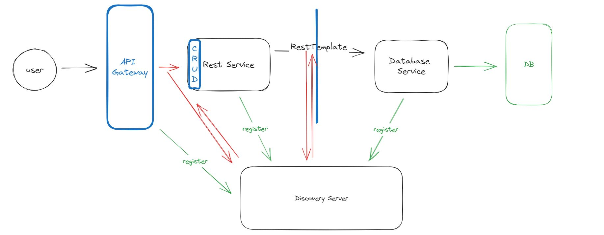

# BookCatalog
BookCatalog is a microservice application using spring boot and spring cloud. The app consists of 4 microservices:
* API Gateway - directs incoming request to the proper service
* Discovery server - registers available services and directs requests to services to an appropriate IP address
* Rest service - outer service which provides a REST API that provides CRUD operations. This service communicates with the Database Service by RestTemplate to get data
* Database Service - inner service which is called by rest service. This service connects with h2 database and returns data.
  


## CRUD methods

#### Rest service supports GET, POST, PUT and DELETE methods. Its url is: /api/books.
GET method allows sorting, filtering and pagination. It accepts optional request params: 
* offset - page number to be returned
* pageSize - number of records to be placed on page
* filter - string that is searched for in the title and author
* sort - array of strings, which have pattern: column,direction

Sample queries:

http://localhost:8080/api/books \
http://localhost:8080/api/books?offset=1&pageSize=2&sort=title,desc \
http://localhost:8080/api/books?offset=0&pageSize=2&filter=Java \
http://localhost:8080/api/books?sort=author,asc&sort=title,desc 

It is also possible to return a single record using request e.g., http://localhost:8080/api/books/2

POST method requires attaching a BookRequest object in the body.
Sample request would be:\
http://localhost:8080/api/books \
with sample body:
```
{
"title": "New title",
"author": "New Author",
"publicationYear": 2023,
"pages": 1000
}
```

PUT method requires attaching a BookRequest object in the body and id of the object to be updated as request param.
Sample request would be:\
http://localhost:8080/api/books/3 \
with sample body:
```
{
"title": "Edited title",
"author": "Edited Author",
"publicationYear": 2023,
"pages": 1000
}
```

DELETE method requires attaching an id of the object to be deleted as request param.\
Sample request would be:\
http://localhost:8080/api/books/3 

